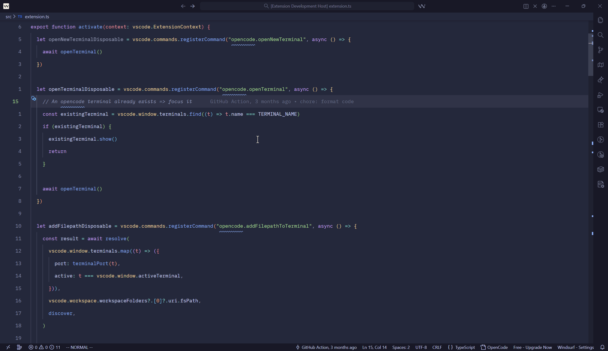

# OpenCode Connector for VS Code

**Bridge the gap between your favorite editor and your favorite AI assistant.**

OpenCode is fantastic as a standalone TUI (Terminal User Interface). It's powerful, agentic, and works with any editor. But if you spend your day in VS Code, constantly switching contexts or copy-pasting code snippets breaks your flow.

**This extension integrates the OpenCode TUI directly into your VS Code workflow.**



## Why use this extension?

You shouldn't have to choose between a great editor (VS Code) and a great AI agent (OpenCode). This connector gives you the best of both worlds:

1.  **Context Awareness**: The TUI automatically "knows" what file you are working on. The extension sends your active file, selection, and diagnostics to the OpenCode context.
    - *No more copy-pasting code blocks.*
    - *No more manually typing file paths.*

2.  **Seamless Process Management**:
    - *Auto-Discovery*: The extension automatically finds running OpenCode instances serving your current workspace.
    - *Auto-Spawn*: If no instance is running, it spawns one for you in the integrated terminal.
    - *One command to rule them all.*

## Features

### Commands

| Command | Description | Keyboard Shortcut |
|---------|-------------|-------------------|
| `OpenCode: Add to Prompt` | Send the current file reference (e.g., `@src/main.ts#L10-L20`) to the TUI | `Ctrl+Shift+A` / `Cmd+Shift+A` |
| `OpenCode: Select Files to Add` | Open a file picker to select multiple files to add to the prompt | `Ctrl+Shift+Alt+A` / `Cmd+Shift+Alt+A` |
| `OpenCode: Check Instance` | Check if an OpenCode instance is running and connected |
| `OpenCode: Show Workspace` | Display workspace information detected by the extension |
| `OpenCode: Show Menu` | Quick access menu from the status bar |

### Code Actions

- **Explain and Fix (OpenCode)**: Click on any diagnostic (error, warning, info) and select this quick fix to send the error details to OpenCode for explanation and automatic fixing.

### Gutter Indicators

- **Diagnostic Gutter Icons**: Lines with diagnostics (errors, warnings) show an icon in the gutter.
- **Quick Actions**: Hover over a diagnostic line to see a QuickPick menu with options to:
  - Explain the error with AI
  - Fix the error automatically

### Status Bar

- **Connection Status**: Shows whether OpenCode is connected (`● OpenCode`) or disconnected (`○ OpenCode`).
- **Click to Manage**: Click the status bar item to access connection management options.

### Automatic Context Sync

- Tracks your active document, selection, and diagnostics in real-time
- Sends context automatically when you use commands

### Integrated Terminal

- Runs the OpenCode TUI directly within VS Code's terminal panel
- Auto-focuses the terminal after sending prompts (configurable)

## Usage

1.  Open your project in VS Code.
2.  The extension will find or spawn an OpenCode TUI session.
3.  Use **`OpenCode: Add to Prompt`** (or `Ctrl+Shift+A`) to reference your current code in the TUI.
4.  Use **`OpenCode: Select Files to Add`** (or `Ctrl+Shift+Alt+A`) to pick multiple files to add to the prompt.
5.  Use **`Explain and Fix (OpenCode)`** to quickly fix errors - hover over any error or click the lightbulb.

## Configuration

You can customize the extension behavior through the following VS Code settings:

| Setting | Type | Default | Description |
|---------|------|---------|-------------|
| `opencode.port` | number | `4096` | Port for OpenCode server connection |
| `opencode.binaryPath` | string | `""` | Absolute path to OpenCode binary (leave empty to use PATH) |
| `opencode.codeAction.severityLevels` | array | `["error", "warning", "information", "hint"]` | Diagnostic severity levels that trigger the "Explain and Fix" code action |
| `opencode.autoFocusTerminal` | boolean | `true` | Automatically focus OpenCode terminal after sending prompts |

## Requirements

- VS Code 1.94.0 or higher
- [OpenCode](https://opencode.ai) installed and available in your PATH (or configured via `opencode.binaryPath`)

## Running OpenCode

For the extension to detect your OpenCode instance, it must be running in **server mode** with a port specified:

```bash
opencode --port 4096
```

The extension will automatically:
1. **Discover** running OpenCode instances by scanning for processes with `--port`
2. **Match** instances to your current workspace directory
3. **Connect** to the correct instance automatically

If no running instance is found for your workspace, the extension will spawn one automatically in the integrated terminal.

### Manual Start

If you want to start OpenCode manually:

```bash
# Terminal 1
opencode --port 4096
```

Then use VS Code as normal - the extension will detect and connect to it.

## Credits

This extension is inspired by:
- [OpenCode VSCode SDK](https://github.com/anomalyco/opencode/tree/dev/sdks/vscode)
- [opencode.nvim](https://github.com/NickvanDyke/opencode.nvim)
