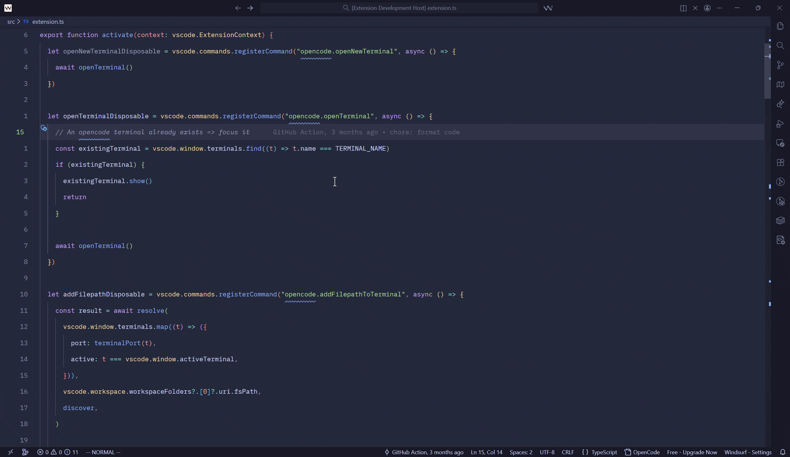

# OpenCode Connector


**Bridge the gap between your favorite editor and your favorite AI assistant.**

OpenCode is fantastic as a standalone TUI (Terminal User Interface). It's powerful, agentic, and works with any editor. But if you spend your day in VS Code, constantly switching contexts or copy-pasting code snippets breaks your flow.

**This extension integrates the OpenCode TUI directly into your VS Code workflow.**



## Why use this extension?

You shouldn't have to choose between a great editor (VS Code) and a great AI agent (OpenCode). This connector gives you the best of both worlds:

1.  **Context Awareness**: When you use commands like "Add to Prompt", the extension sends your active file, selection, and diagnostics to OpenCode.
    - *No more copy-pasting code blocks.*
    - *No more manually typing file paths.*

2.  **Seamless Process Management**:
    - *Auto-Discovery*: The extension automatically finds running OpenCode instances serving your current workspace.
    - *Auto-Spawn*: If no instance is running, it spawns one for you in the integrated terminal.
    - *One command to rule them all.*

## Features

### Commands

| Command | Description | Keyboard Shortcut |
|---------|-------------|-------------------|
| `OpenCode: Add to Prompt` | Send the current file reference (e.g., `@src/main.ts#L10-L20`) to the TUI | `Ctrl+Shift+A` / `Cmd+Shift+A` |
| `OpenCode: Add Selection to Prompt` | Send the selected code range (e.g., `@src/main.ts#L10-L20`) to the TUI | Right-click in editor |
| `OpenCode: Select Files to Add` | Open a file picker to select multiple files to add to the prompt | `Ctrl+Shift+Alt+A` / `Cmd+Shift+Alt+A` |
| `OpenCode: Open in OpenCode` | Open an OpenCode instance for the current workspace as an editor tab | Editor title bar / Explorer right-click |
| `OpenCode: Check Instance` | Check if an OpenCode instance is running and connected | — |
| `OpenCode: Show Workspace` | Display workspace information detected by the extension | — |
| `OpenCode: Show Menu` | Quick access menu from the status bar | — |

### Editor Title Button

A terminal button (⬛) appears in the editor title bar for quick access. Clicking it:

1. Finds a running OpenCode instance for the **current workspace** folder.
2. Opens it as an **editor tab** (like Claude Code) — keeps your terminal panel free.
3. If no instance is running, spawns one automatically.

### Editor Context Menu

Right-click inside any editor to send your selection directly to OpenCode:

- **Add Selection to OpenCode**: Sends the selected code range as `@file#L10-L20` to the active OpenCode instance.
  - Appears only when text is selected (`editorHasSelection`).

### Explorer Context Menu

Right-click files or folders in the Explorer for two sets of actions:

- **Open in OpenCode**: Launch (or re-attach to) an OpenCode instance for that folder's workspace — opens as an editor tab.
- **Add to Opencode → Send Path**: Send absolute file/folder paths (e.g., `@/home/user/project/src/file.ts`)
- **Add to Opencode → Send Relative Path**: Send relative paths (e.g., `@src/file.ts`)

Multiple files/folders can be selected. Directories include a trailing slash.

### Workspace-Aware Routing

All send commands automatically route to the **correct OpenCode instance** for the workspace of your active file. In multi-root workspaces each root folder gets its own instance — no manual switching required.

### Code Actions

- **Explain and Fix (OpenCode)**: Click on any diagnostic (error, warning, info) and select this quick fix to send the error details to OpenCode for explanation and automatic fixing.

### Status Bar

- **Connection Status**: Shows whether OpenCode is connected (`● OpenCode`) or disconnected (`○ OpenCode`).
- **Click to Manage**: Click the status bar item to access connection management options.

### Integrated Terminal

- Runs the OpenCode TUI directly within VS Code's terminal or as an editor tab
- Auto-focuses the terminal after sending prompts (configurable)

## Usage

1.  Open your project in VS Code.
2.  The extension will find or spawn an OpenCode TUI session for your workspace.
3.  Click the **⬛ button** in the editor title bar (or right-click a folder → **Open in OpenCode**) to open the TUI as an editor tab.
4.  Use **`OpenCode: Add to Prompt`** (`Ctrl+Shift+A`) to reference your current file in the TUI.
5.  **Select code** in the editor, right-click → **Add Selection to OpenCode** to send the exact line range.
6.  Use **`OpenCode: Select Files to Add`** (`Ctrl+Shift+Alt+A`) to pick multiple files at once.
7.  Use **`Explain and Fix (OpenCode)`** to quickly fix errors — hover over any error or click the lightbulb.

## Configuration

You can customize the extension behavior through the following VS Code settings:

| Setting | Type | Default | Description |
|---------|------|---------|-------------|
| `opencode.port` | number | `4096` | Port for OpenCode server connection |
| `opencode.binaryPath` | string | `""` | Absolute path to OpenCode binary (leave empty to use PATH) |
| `opencode.codeAction.severityLevels` | array | `["error", "warning", "information", "hint"]` | Diagnostic severity levels that trigger the "Explain and Fix" code action |
| `opencode.autoFocusTerminal` | boolean | `true` | Automatically focus OpenCode terminal after sending prompts |

## Requirements

- VS Code 1.94.0 or higher
- [OpenCode](https://opencode.ai) installed and available in your PATH (or configured via `opencode.binaryPath`)

## Running OpenCode

For the extension to detect your OpenCode instance, it must be running in **server mode** with a port specified:

```bash
opencode --port 4096
```

The extension will automatically:
1. **Discover** running OpenCode instances by scanning for processes with `--port`
2. **Match** instances to your current workspace directory
3. **Connect** to the correct instance automatically

If no running instance is found for your workspace, the extension will spawn one automatically in the integrated terminal.

### Manual Start

If you want to start OpenCode manually:

```bash
# Terminal 1
opencode --port 4096
```

Then use VS Code as normal - the extension will detect and connect to it.

## Credits

This extension is inspired by:
- [OpenCode VSCode SDK](https://github.com/anomalyco/opencode/tree/dev/sdks/vscode)
- [opencode.nvim](https://github.com/NickvanDyke/opencode.nvim)
